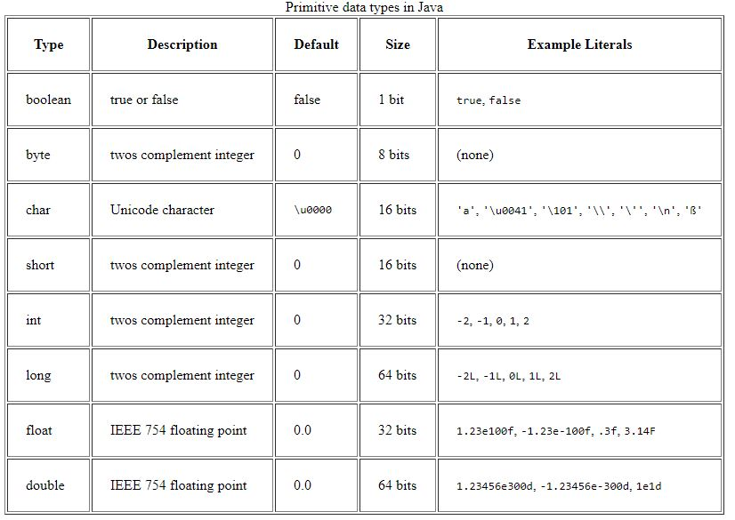

# Primitive Types #

Know how int, char, double, etc.. are represented in memory and the primitive operations on them.

- General Info   
    
    

- Need to Know 
    - [The Bitwise Operators](https://www.tutorialspoint.com/java/java_basic_operators.htm)
    - [Constant denoting the maximum and minimum values for numerical types](https://howtodoinjava.com/java/basics/primitive-data-types-in-java/)
        - Integer.Min_Value
        - Float.Max_Value
        - Double.Size
        - Boolean.True
    - [Box-types](http://zetcode.com/lang/java/datatypes2/)
        - Boolean.valueOf(true)
        - Integer.parseInt("42")
        - Float.toString(-1.23)
    - [Box-type static methods for comparing values](http://zetcode.com/lang/java/datatypes2/)  
        - Double.compare (x, 1.23) = 0
    - [Math methods](https://docs.oracle.com/javase/8/docs/api/java/lang/Math.html)
        - abs (-34.5)
        - ceil (2.17)
        - floor (3.14)
        - min (x, -4)
        - max (3.14, y)
        - pow (2.71, 3.14)
        - sqrt (225)
    - [Limits of autoboxing](https://effective-java.com/2010/05/the-advantages-and-traps-of-autoboxing/) 
        - Why Character[] C = new char [] {'a', 'b'}; will not compile
    - [Interconvert types](https://docs.oracle.com/javase/tutorial/java/data/converting.html) 
        - Character.getNumberValue(x)
        - String.valueOf(123)
    - [Random Methods](https://docs.oracle.com/javase/8/docs/api/java/util/Random.html)
        - nextInt(16)
        - nextInt()
        - nextBoolean()
        - nextDouble()
 
- Practice Code:
    - [ ] [countBits](Code/countBits.java)   
    

